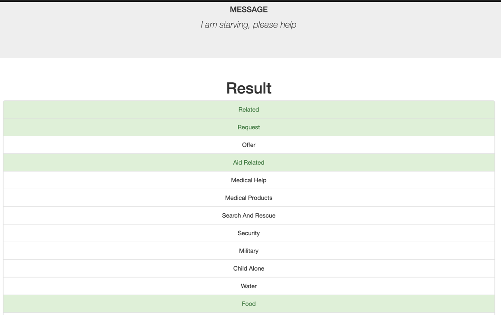
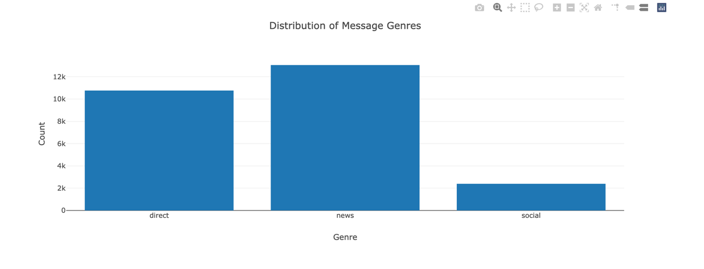
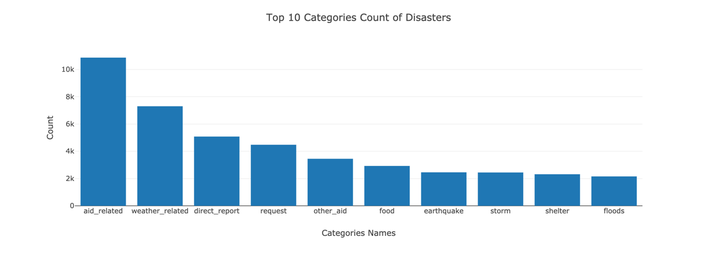
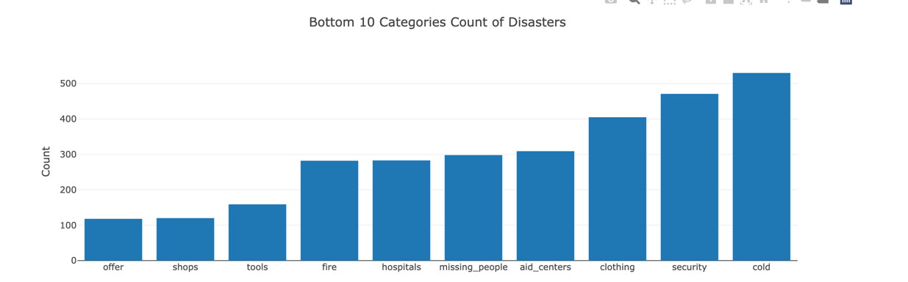

# Disaster Response Pipeline Project

### Table of Contents

- [Environment](#environment)
- [Instructions of Running the Programs](#instructions)
- [Project Overview](#overview)
- [Structure of Projects](#structure)
- [Delivery](#delivery)

### Environment 
Beside standard Conda Library, follow library need to installed:

- argparse

Following packages needs to be downloaded from NLTK before first used:

- punkt
- stopwords
- wordnet

### Instructions of Running the Programs: 
1. Run the following commands in the project's root directory to set up your database and model. `argparse` is introduced instead of python default arg library from python.

    - To run ETL pipeline that cleans data and stores in database
        `python data/process_data.py --msgcsv disaster_messages.csv --catcsv disaster_categories.csv --dbfilename DisasterResponse.db`
    - To run ML pipeline that trains classifier and saves
        `python models/train_classifier.py --sourcedb DisasterResponse.db --modeloutput classifier.pkl`

2. Run the following command in the app's directory to run your web app.
    `python run.py`

3. Go to http://0.0.0.0:3001/

### Project Overview 
Data Engineering, NLP and Flask API were applied to build an APP/API which potentially help emergency department to pass related disaster agency faster.

### Structure of Projects:  
#### app:
    templates(for Web API)
        go.html 
        master.html
#### Data:
    disaster_categories.csv (disaster lable file)
    disaster_messages.csv (disaster message)
    DisasterResponse.db (output db file, NOT include in this git)
    process_data.py (Main Program to clean and transform the source files for model to consume)
#### model:
    classifier.pkl (Model output file, NOT including in the git)
    train_classifier.py ( Main Program to read Source DB, train and save the model) 

### Delivery: 
A web API was created to show the summary of 36 disaster categories and functionality to categorized new disaster messages to its corresponding categories.
#### Examples and Screenshot
Categorize messages:

Distribution of genres:

Top and Bottom 10 Counts of Categories:

